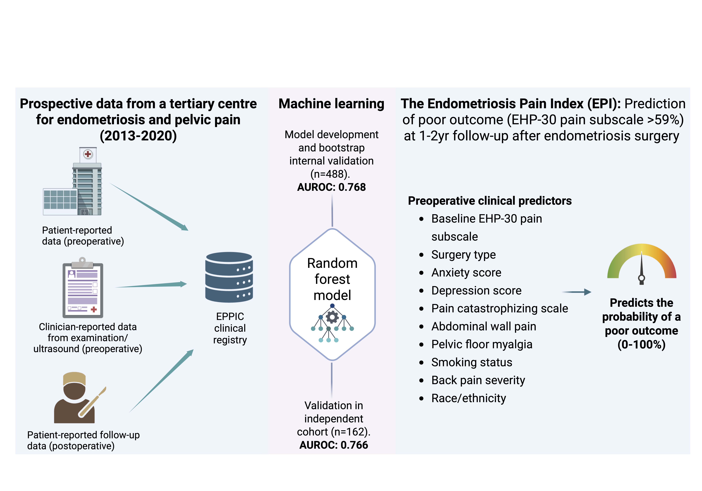
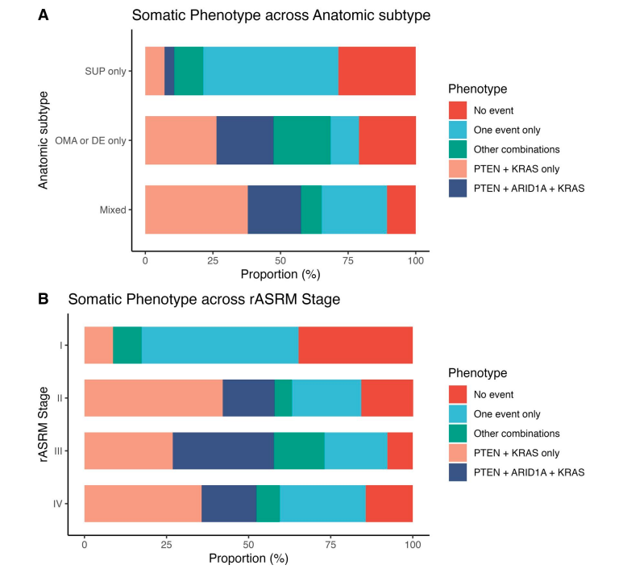
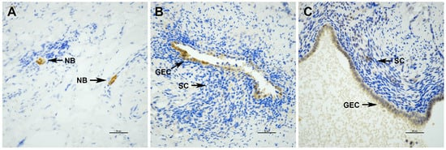
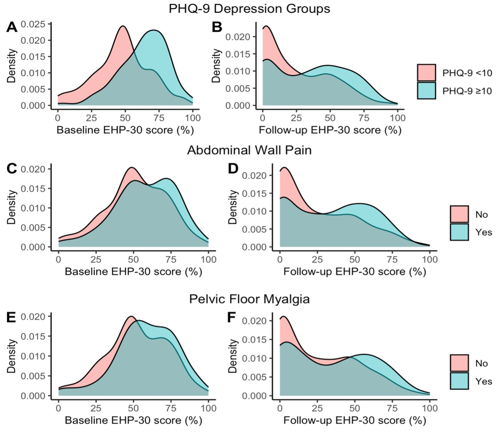
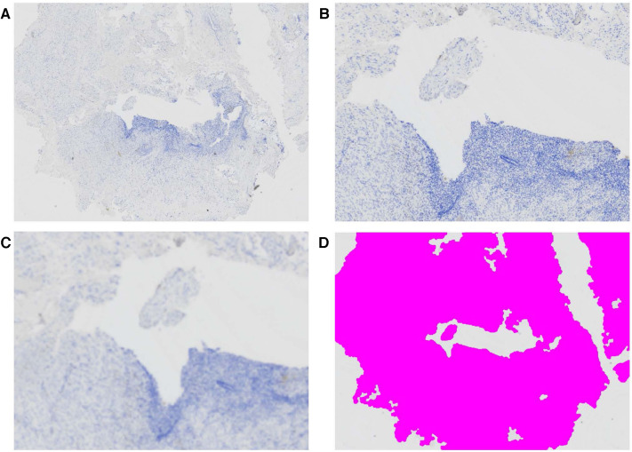
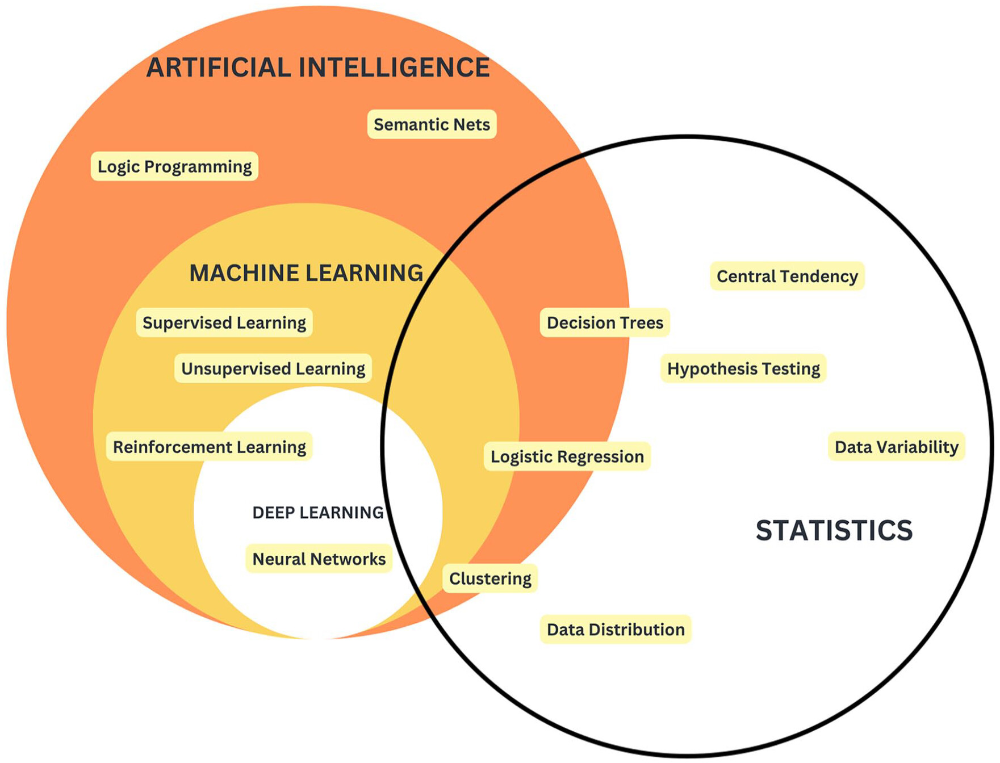
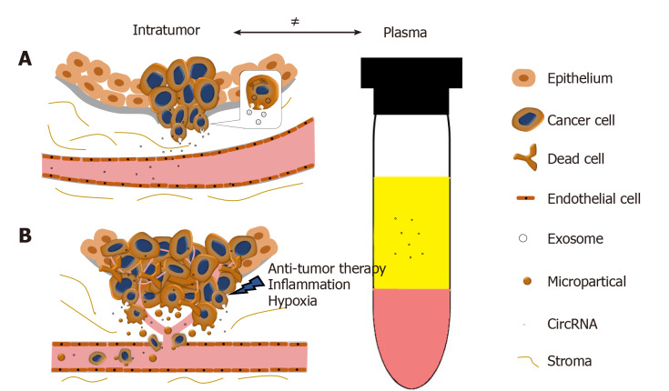

## Ongoing Research
### Cost-Related Medication Nonadherence (CRNA) in Canada
I am currently leading research examining **cost-related medication nonadherence (CRNA)** in the general Canadian population. CRNA occurs when individuals delay filling prescriptions, reduce doses, or do not take medications as prescribed due to financial barriers. Using **nationally representative (weighted) survey** data, this work aims to identify who is at highest risk of CRNA and to better understand the structural, socioeconomic, and health-related factors that drive it. We are applying both **traditional epidemiologic methods and predictive modelling approaches** to quantify risk and improve identification of vulnerable populations. The goal of this research is to inform equitable drug policy, improve access to essential medications, and support evidence-based health system decision-making in Canada.

### Perinatal Outcomes and Arthritis Medications
Another ongoing area of research focuses on the safety of arthritis medications during pregnancy, particularly biologic and biosimilar disease-modifying antirheumatic drugs (DMARDs).
Using **large, linked administrative health datasets in British Columbia**, we are examining maternal and infant outcomes among individuals exposed to these medications before and during pregnancy. This includes evaluating risks such as preterm birth, birth weight, infections, and pregnancy complications.**This work contributes real-world evidence to an area where clinical trial data are limited**, helping patients and clinicians make more informed decisions about treatment during pregnancy while balancing disease control and safety.

## Original Clinical & Molecular Research
### [Predicition Model for Persistent Pain after Endometriosis Surgery](https://journals.lww.com/pain/fulltext/9900/endometriosis_pain_index__development_of_a_model.1125.aspx)
\ **Tucker DR**, Dungate B, Chiu DS, Noga HL, Lee C, Bedaiwy MA, Williams C, Allaire C, Talhouk A, Yong PJ. PAIN. 2026.
&nbsp;

# 

Pain outcomes after endometriosis surgery vary widely. Up to 38% of individuals continue to experience persistent pain after surgery, and as many as 50% may undergo additional procedures. Despite this, there are very few tools available to help predict who is most likely to benefit from surgery. 

In this study, I developed a model to estimate pain-related quality of life after endometriosis surgery using information available before surgery. To do this, **I used advanced statistical and machine learning methods to examine how different pre-surgical clinical factors work together to influence pain outcomes.** The final model, called the **Endometriosis Pain Index (EPI)**, uses 10 pre-surgical factors to estimate a person's probability of experiencing poor pain-related quality of life after surgery. The EPI is available as an calculator via **R Shiny**.

The goal of the EPI is not to replace clinical judgment, but to support more informed conversations between patients and clinicians. By providing individualized risk estimates, it can help guide shared decision-making and support more personalized care. The project utilizes prospectively collected clinical data from the [Endometriosis Pelvic Pain Interdisciplinary Cohort (EPPIC)](https://yonglab.med.ubc.ca/eppic/).

### [Somatic PTEN and ARID1A loss and endometriosis disease burden: a longitudinal study](https://academic.oup.com/humrep/advance-article/doi/10.1093/humrep/deae269/7928994)
\ **Tucker DR**, Lee AF, Orr NL, Alotaibi FT, Noga HL, Williams C, Allaire C, Bedaiwy MA, Huntsman DG, Köbel M, Anglesio MA, Yong PJ. Human Reproduction. 2024.
&nbsp;

# 

"**Cancer-driver mutations** have been identified in endometriosis cases without cancer, but their roles in the disease remain unclear. In this study, participants undergoing endometriosis surgery prospectively consented to have their tissue biopsy samples added to a biobank. I investigated the presence of abnormal alterations in two notable cancer-related markers: **PTEN and ARID1A**. Using **immunohistochemistry**, I assessed the pathology of the samples for loss of staining, indicative of potential loss or reduced presence of proteins associated with  alterations or mutations in these genes. The analysis revealed that PTEN loss was common in endometriosis in this cohort (**68%**); it was also associated with worse anatomic severity, advanced disease stage, increased surgical difficulty, and ethnic disparities. These findings highlight the potential importance of PTEN loss and other somatic mutations in endometriosis as candidates for a future molecular classification system. **All analyses (descriptive, bivariate, survival analyses etc.) and visualizations were conducted using R**.

### [Nerve Bundle Density and Expression of NGF and IL-1β Are Intra-Individually Heterogenous in Subtypes of Endometriosis](https://pubmed.ncbi.nlm.nih.gov/38785989/)
\ Sreya M, **Tucker DR**, Yi J, Alotaibi FT, Lee AF, Noga H, Yong, PJ. Biomolecules. 2024;14(5):583.
&nbsp;

# 

Endometriosis is a gynecological disorder marked by local inflammation and increased nerve bundle density due to elevated nerve growth factor (NGF) and interleukin-1β (IL-1β) levels. We analyzed tissue samples from 12 patients with various endometriosis subtypes (deep, superficial peritoneal, endometrioma), using **immunohistochemistry** to measure nerve bundle density (PGP9.5) and NGF and IL-1β expression. Our findings revealed significant heterogeneity in nerve bundle density and marker expression across different lesion subtypes within the same patient, with most patients showing a coefficient of variation (CV) ≥ 100%. These results suggest that future studies should stratify markers of neuroproliferation by anatomic subtype to improve clinical correlations.
&nbsp;

&nbsp;

### [Pelvic pain comorbidities and quality of life after endometriosis surgery](https://pubmed.ncbi.nlm.nih.gov/37148956/) 
\ **Tucker DR**, Noga HL, Lee C, Chiu DS, Bedaiwy MA, Williams C, Allaire C, Talhouk A, Yong PJ. Am J Obstet Gynecol. 2023;229(2):147.e1-147.e20.
&nbsp;

Endometriosis is a chronic condition affecting ~10% of reproductive-aged women. Surgery is an effective treatment for most individuals with endometriosis-related pain, however a significant proportion experience persistent/ recurrent pain. Persistent/ recurrent pain after endometriosis surgery may be due to central sensitization or nociplastic pain. In centralized pain, pain processing in the brain is altered leading to pain perception even after the pain stimili (e.g. endometriosis lesions) is removed. In this prospective longitudinal study, we used **multivariable linear regression models** to examine whether the preoperative presence of pelvic pain comorbidities, indicative of underlying central sensitization,is associated with worse pain-related quality of life after endometriosis surgery.  Additionally, we trained **LASSO regression models via cross-validation** to identify the most influential variables on follow-up quality of life scores and presented coefficients and confidence intervals based on **1000 bootstrap samples.**

&nbsp;

### [Standardized protocol for quantification of nerve bundle density as a biomarker for endometriosis](https://pubmed.ncbi.nlm.nih.gov/38098984) 
\ Zoet G, **Tucker DR**, Orr NL, Alotaibi FT, Liu YD, Noga H, Köbel M, Yong PJ.Front Reprod Health. 2023;5:1297986.
&nbsp;

We propose a standardized protocol for the measurement of nerve bundle density (PGP9.5) in endometriosis environment (including deep endometriosis, ovarian endometriomas and superficial peritoneal endometriosis) as a potential biomarker reflecting local neurogenesis.

&nbsp;

&nbsp;

&nbsp;

&nbsp;

## Journal Reviews

### [Scoping review of biosimilar disease-modifying antirheumatic drugs in pregnancy: evidence gaps and proposed outcome reporting framework](https//https://pubmed.ncbi.nlm.nih.gov/41021022/)
\ Cheng V, Amiri N, Cheng V, Ellis U, Cragg JJ, Proulx L, **Tucker DR**, & De VeraMA. Rheumatology international.2025
&nbsp;

This scoping review examined what is currently known about the use of biosimilar biologic drugs—lower-cost versions of biologic therapies during pregnancy. We identified only six small studies, mostly descriptive, involving biosimilars used to treat autoimmune conditions such as arthritis and inflammatory bowel disease. Reported outcomes varied and were inconsistently measured, highlighting major evidence gaps. To improve future research, we proposed a Reproductive Health Outcomes Reporting Framework. Our review is the first synthesis of perinatal evidence on biosimilar DMARDs and underscores the need for larger, standardized studies to guide safe treatment during pregnancy.

### [Assessing the Utility of artificial intelligence in endometriosis: Promises and pitfalls](https://journals.sagepub.com/doi/full/10.1177/17455057241248121)
\ Dungate B, **Tucker DR**, Goodwin E, Yong PJ. Womens Health (Lond). 2024;20:17455057241248121.
&nbsp;

This study examines how artificial intelligence (AI) can improve the diagnosis and treatment of endometriosis, a condition that affects many women but is underfunded and hard to diagnose due to varied symptoms. AI, which analyzes large datasets to find new patterns, is increasingly used in medical research. Its applications in endometriosis include diagnostic tools and treatment prediction, potentially reducing diagnostic delays, healthcare costs, and providing better treatment options. However, AI's success depends on high-quality data and skilled implementation. The review highlights the need for careful and transparent use of AI to avoid mistakes and ensure reliable outcomes, calling for more oversight in AI research to enhance endometriosis care.

&nbsp;

### [Circular RNA and its potential as prostate cancer biomarkers](https://pubmed.ncbi.nlm.nih.gov/32879844)
\ **Tucker D**, Zheng W, Zhang DH, Dong X. World J Clin Oncol. 2020;11(8):563-572.
&nbsp;

Advancing knowledge of the transcriptome has revealed that circular RNAs (circRNAs) are widely expressed and evolutionarily conserved molecules that may serve relevant biological roles. More interesting is the accumulating evidence which demonstrates the implication of circRNAs in diseases, especially cancers. This revelation has helped to form the rationale for many studies exploring their utility as clinical biomarkers. CircRNAs are highly stable due to their unique structures, exhibit some tissue specificity, and are enriched in exosomes, which facilitate their detection in a range of body fluids. These properties make circRNAs ideal candidates for biomarker development in many diseases. This review will outline the discovery, biogenesis, and proposed functions of circRNAs.

&nbsp;

&nbsp;

&nbsp;

